# VPN WireGuard on Vultr

This repository documents the process of setting up a secure VPN using WireGuard on a Vultr cloud instance. It is part of my cybersecurity portfolio and provides detailed instructions, scripts, and configuration samples for deploying a fully functional VPN.

---

## Table of Contents

- [Overview](#overview)
- [Project Structure](#project-structure)
- [Requirements](#requirements)
- [Installation & Setup](#installation--setup)
  - [Server Setup](#server-setup)
  - [Client Setup](#client-setup)
- [Testing](#testing)
- [Screenshots](#screenshots)
- [Troubleshooting](#troubleshooting)
- [License](#license)
- [Acknowledgments](#acknowledgments)

---

## 1. Overview

**Project Demonstrates:**
- Provisioning a Debian-based server on Vultr.
- Installing and configuring WireGuard.
- Setting up NAT and IP forwarding for full-tunnel VPN access.
- Generating and configuring client keys and configurations.
- Testing connectivity.

---

## 2. Project Structure

```
vpn-wireguard-vultr/
├── README.md
├── docs/
│   ├── outline.md          # Detailed project roadmap and step-by-step instructions.
│   └── usage.md            # Deployment and usage guide for the VPN.
├── scripts/
│   └── install-wireguard.sh  # Script to install and configure WireGuard on the server.
├── config/
│   ├── wg0.conf.sample       # Sample server configuration file.
│   └── wg0-client.conf.sample  # Sample client configuration file.
└── screenshots/
    ├── Various setup and testing screenshots.
```

---

## 3. Requirements

- **Vultr Account:** with a Debian-based instance (Debian 12 recommended).
- **Access:** SSH access and sudo privileges on the server.
- **Knowledge:** Basic familiarity with Linux command-line operations.
- **Client Device:** (e.g., Mac) with the official WireGuard client installed.

---

## 4. Installation & Setup

### Server Setup

1. **Provision the Vultr Instance:**
   - Deploy a new Debian 12 instance.
   - Minimum specs: 1 vCPU, 1 GB RAM, 25 GB SSD.
   - Add your SSH key during provisioning.

2. **Clone the Repository on the Server:**
   ```bash
   git clone https://github.com/chetflowers/vpn-wireguard-vltr.git
   cd vpn-wireguard-vultr
   ```

3. **Run the WireGuard Installation Script:**
   ```bash
   cd scripts
   ./install-wireguard.sh
   ```

4. **Enable & Start WireGuard:**
   ```bash
   systemctl enable wg-quick@wg0
   systemctl start wg-quick@wg0
   ```

5. **Set Up NAT (Masquerading):**
   ```bash
   iptables -t nat -A POSTROUTING -o enp1s0 -j MASQUERADE
   sysctl -p
   ```

### Client Setup

1. **Generate Client Keys:**
   ```bash
   wg genkey | tee client_private.key | wg pubkey > client_public.key
   ```

2. **Configure the Client:**
   ```ini
   [Interface]
   PrivateKey = <your client private key>
   Address = 10.0.0.2/32
   DNS = 8.8.8.8

   [Peer]
   PublicKey = <server public key from install script>
   Endpoint = 64.237.48.180:51820
   AllowedIPs = 0.0.0.0/0, ::/0
   PersistentKeepalive = 25
   ```

3. **Add the Client as a Peer on the Server:**
   ```ini
   [Peer]
   PublicKey = <contents of client_public.key>
   AllowedIPs = 10.0.0.2/32
   ```

4. **Restart WireGuard:**
   ```bash
   wg-quick down wg0
   wg-quick up wg0
   ```

---

## 5. Testing

- **Ping Test:**  
  ```bash
  ping 8.8.8.8
  ```
- **Traceroute Test:**  
  ```bash
  traceroute 8.8.8.8
  ```
- **Public IP Verification:**  
  ```bash
  curl https://api.ipify.org
  ```

---

## 6. Screenshots

Below are relevant screenshots capturing various stages of the VPN setup process:

### **Vultr Server Setup**
- **Vultr Dashboard:**  
  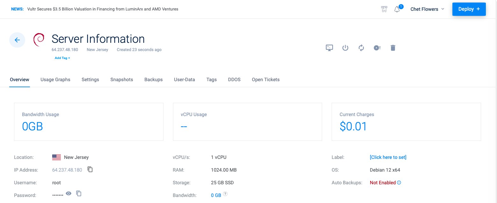
- **Vultr Instance Details:**  
  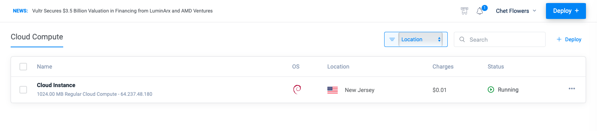

### **WireGuard Installation and Configuration**
- **Updating and Upgrading System:**  
  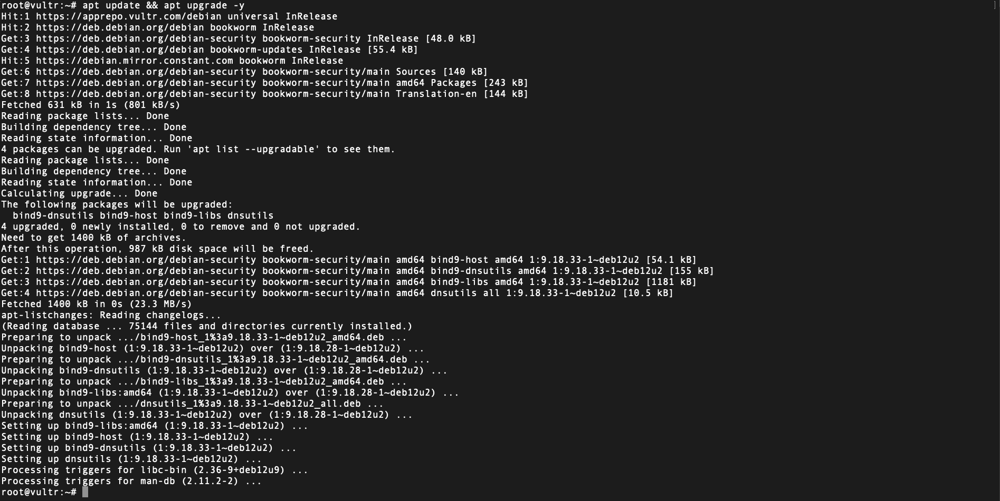
- **Installing WireGuard:**  
  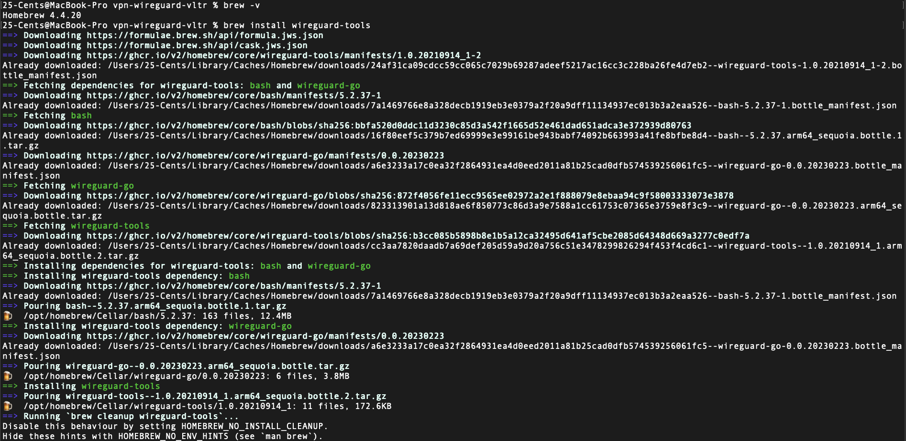
- **Running install-wireguard.sh:**  
  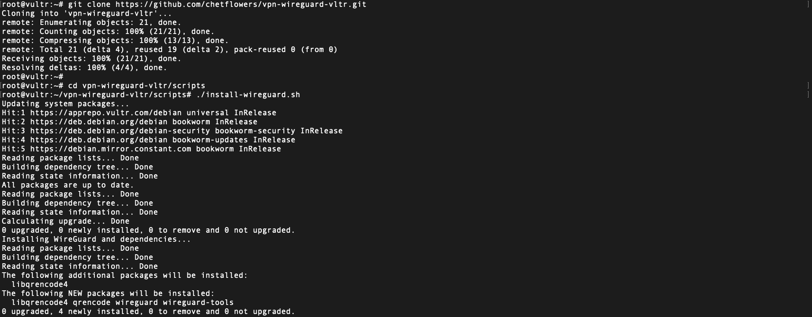
- **Generating WireGuard Keys:**  
  
- **WireGuard Server Configuration (`wg0.conf`):**  
  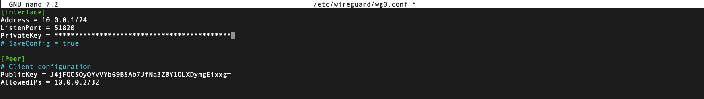
- **Enabling and Starting WireGuard (`wg-quick`):**  
  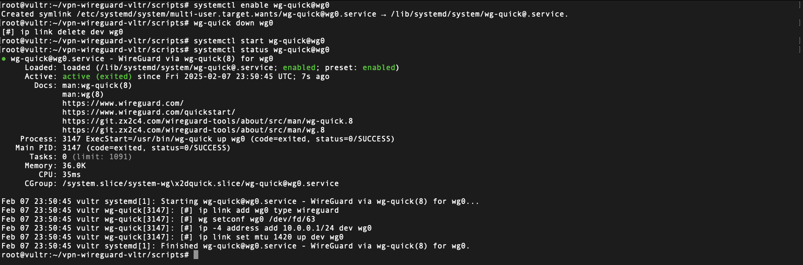

### **Network and Routing Configuration**
- **Checking Network Interfaces (`ip a`):**  
  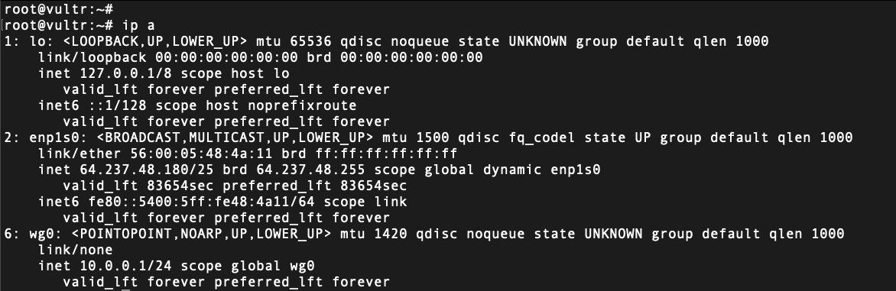
- **Configuring IP Tables (NAT Masquerade):**  
  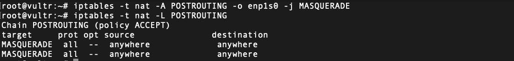
- **Verifying IP Tables Configuration:**  
  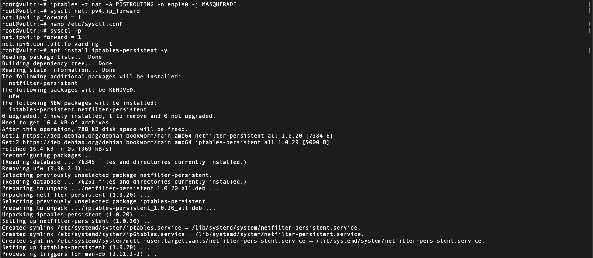

### **Testing and Verification**
- **Verifying WireGuard Interface (`wg show`):**  
  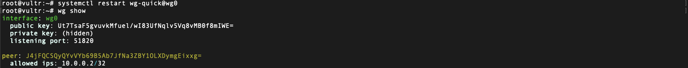
- **Checking Client Configuration (`wg0-client.conf`):**  
  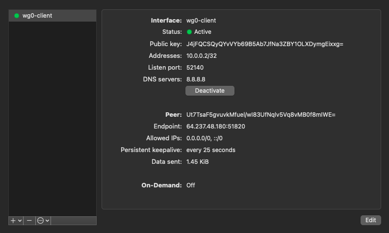
- **Pinging Google DNS to Confirm Connectivity (`ping 8.8.8.8`):**  
  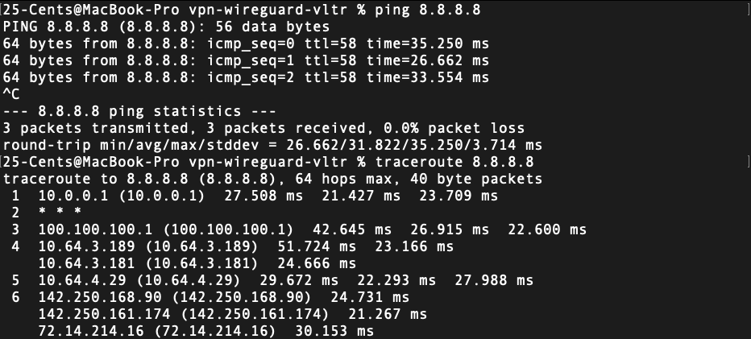
- **Checking Public IP (`api.ipify.org`):**  
  

---

## 7. Troubleshooting

- **DNS Issues:** Ensure `DNS = 8.8.8.8` is set in the client configuration.
- **Routing Issues:** Check your routing table:
  ```bash
  netstat -rn | grep default
  ```

---

## 8. License

This project is licensed under the MIT License.

---

## 9. Acknowledgments

- Thanks to [WireGuard](https://www.wireguard.com/) and Vultr.
- Thanks to [Vultr](https://www.vultr.com/) for cloud hosting services.
