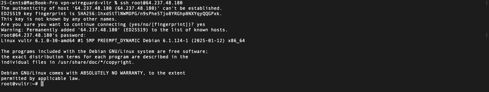
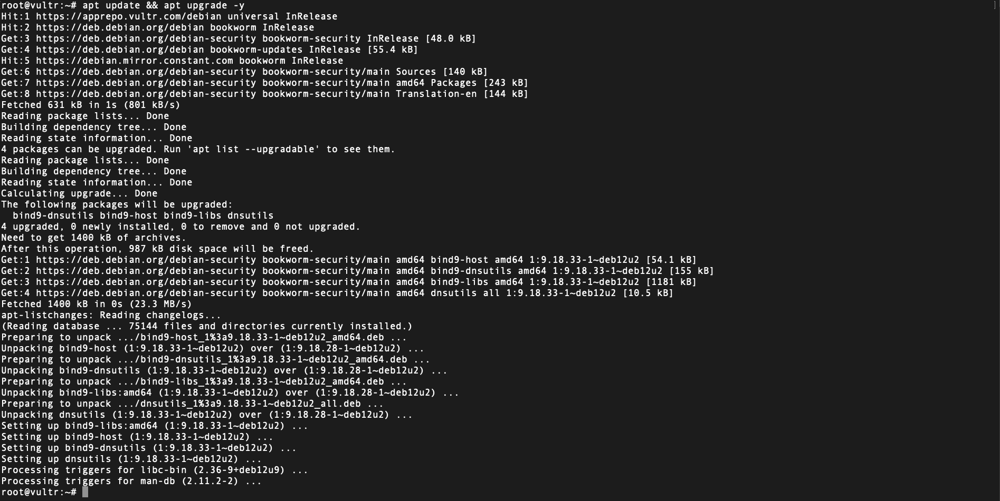
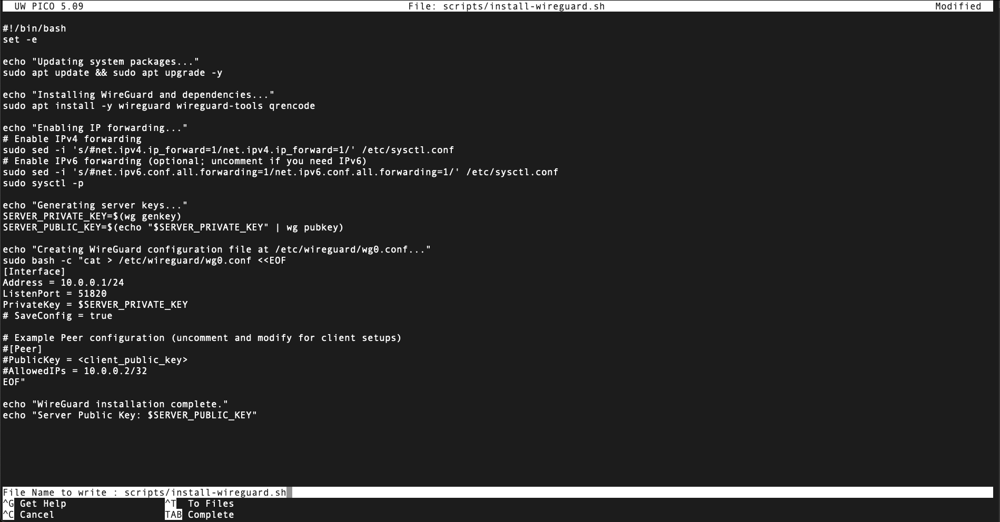
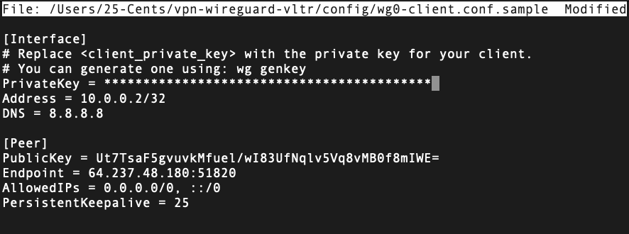

# VPN WireGuard on Vultr

This repository documents the process of setting up a secure VPN using WireGuard on a Vultr cloud instance. It is part of my cybersecurity portfolio and provides detailed instructions, scripts, and configuration samples for deploying a fully functional VPN.

---

## Table of Contents

- [Overview](#overview)
- [Project Structure](#project-structure)
- [Requirements](#requirements)
- [Installation & Setup](#installation--setup)
  - [Server Setup](#server-setup)
  - [Automated WireGuard Installation](#automated-wireguard-installation)
  - [Firewall & NAT Configuration](#firewall--nat-configuration)
  - [Client Setup](#client-setup)
- [Testing & Verification](#testing--verification)
- [Screenshots](#screenshots)
- [Troubleshooting](#troubleshooting)
- [License](#license)
- [Acknowledgments](#acknowledgments)

---

## 1. Overview

This project demonstrates the deployment of a **self-hosted VPN** using WireGuard on a Vultr cloud instance. It showcases **automated deployment, firewall security, and full traffic encryption** for privacy and secure remote access.

### **Key Features**
✅ **Automated Deployment**: Bash script automates installation and configuration.  
✅ **Full-Tunnel Routing**: All internet traffic is routed through the VPN.  
✅ **Cloud-Based VPN**: Hosted on **Vultr Debian 12** with key-based authentication.  
✅ **Firewall & NAT Rules**: Configured `iptables` for NAT masquerading and security.  
✅ **Auto-Start on Boot**: WireGuard is configured to start automatically.  
✅ **Cross-Platform Support**: Mac, Linux, iOS, and Android supported.  
✅ **Testing & Debugging Steps**: Connectivity and security verification included.  

---

## 2. Project Structure

```
vpn-wireguard-vultr/
├── README.md
├── docs/
│   ├── outline.md          # Detailed project roadmap and step-by-step instructions.
│   └── usage.md            # Deployment and usage guide for the VPN.
├── scripts/
│   └── install-wireguard.sh  # Script to install and configure WireGuard on the server.
├── config/
│   ├── wg0.conf.sample       # Sample server configuration file.
│   └── wg0-client.conf.sample  # Sample client configuration file.
└── screenshots/
    ├── Various setup and testing screenshots.
```

---

## 3. Requirements

- **Vultr Account** with a Debian-based instance (Debian 12 recommended).
- **SSH Access** and sudo privileges on the server.
- **Basic Networking & Linux CLI Knowledge**.
- **WireGuard Client** installed on macOS, Linux, or mobile.

---

## 4. Installation & Setup

### **Server Setup**

1. **Provision the Vultr Instance:**
   - Deploy a **Debian 12** instance.
   - Minimum specs: **1 vCPU, 1 GB RAM, 25 GB SSD**.
   - Add an **SSH key** for secure authentication.
  


2. **Connect to the Server via SSH:**
   ```bash
   ssh root@<server-ip>
   ```


3. **Update & Upgrade System Packages:**
   ```bash
   sudo apt update && sudo apt upgrade -y
   ```


4. **Install Required Networking Tools:**
   ```bash
   sudo apt install curl net-tools traceroute -y
   ```


---

### **Automated WireGuard Installation**

1. **Clone the Repository:**
   ```bash
   git clone https://github.com/chetflowers/vpn-wireguard-vltr.git
   cd vpn-wireguard-vultr/scripts
   ```

2. **Run the WireGuard Installation Script:**
   ```bash
   ./install-wireguard.sh
   ```
   

3. **Script Actions:**
   - Installs WireGuard and dependencies.
   - Enables IP forwarding.
   - Generates **server public/private keys**.
   - Creates and applies `/etc/wireguard/wg0.conf`.
   - Starts and enables WireGuard to **launch on boot**:
     ```bash
     sudo systemctl enable wg-quick@wg0
     sudo systemctl start wg-quick@wg0
     ```
---

### **Firewall & NAT Configuration**

1. **Enable IP Forwarding:**
   ```bash
   echo "net.ipv4.ip_forward=1" | sudo tee -a /etc/sysctl.conf
   sudo sysctl -p
   ```

2. **Configure NAT Masquerading for Internet Access:**
   ```bash
   sudo iptables -t nat -A POSTROUTING -o enp1s0 -j MASQUERADE
   ```


---

### **Client Setup**

1. **Generate Client Keys:**
   ```bash
   wg genkey | tee client_private.key | wg pubkey > client_public.key
   ```

2. **Configure the WireGuard Client (`wg0-client.conf`):**
   ```ini
   [Interface]
   PrivateKey = <your client private key>
   Address = 10.0.0.2/32
   DNS = 8.8.8.8

   [Peer]
   PublicKey = <server public key>
   Endpoint = <server-ip>:51820
   AllowedIPs = 0.0.0.0/0, ::/0
   PersistentKeepalive = 25
   ```

  

3. **Restart WireGuard on the Client:**
   ```bash
   wg-quick down wg0
   wg-quick up wg0
   ```
---

## 5. Testing & Verification

1. **Ping Test:**  
   ```bash
   ping 8.8.8.8
   ```

2. **Traceroute Test:**  
   ```bash
   traceroute 8.8.8.8
   ```

3. **Public IP Verification:**  
   ```bash
   curl https://api.ipify.org
   ```


---

## 6. Screenshots

Below are relevant screenshots capturing various stages of the VPN setup process:

- **Provisioning Vultr Instance**
- **Installing & Configuring WireGuard**
- **Firewall & NAT Configuration**
- **Client Connectivity & Testing**

(Screenshots included in `screenshots/` folder)

---

## 7. Troubleshooting

- **WireGuard Not Starting on Boot?**
  ```bash
  sudo systemctl enable wg-quick@wg0
  sudo systemctl restart wg-quick@wg0
  ```

- **No Internet Access from VPN Client?**
  ```bash
  sudo iptables -t nat -A POSTROUTING -o enp1s0 -j MASQUERADE
  ```

- **Verify Server Configuration:**
  ```bash
  wg show
  ```

- **Check Server Logs for Errors:**
  ```bash
  sudo journalctl -u wg-quick@wg0 --no-pager | tail -20
  ```

---

## 8. License

This project is licensed under the MIT License.

---

## 9. Acknowledgments

- Thanks to [WireGuard](https://www.wireguard.com/) and Vultr.
- Thanks to [Vultr](https://www.vultr.com/) for cloud hosting services.
